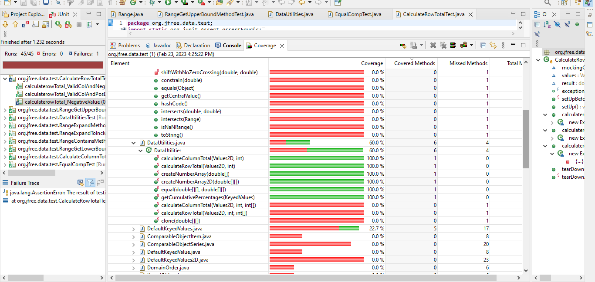

**SENG 637 - Dependability and Reliability of Software Systems**

**Lab. Report #3 – Code Coverage, Adequacy Criteria and Test Case Correlation**

| Group 8:      |     |
| -------------- | --- |
|Student Names |     |
|Amir Allahveran                 |  30216696   |
|Sepehr Ganji                |   30223725  |
|Zahra Arabi Narei         |  30191990   |
|Sara Montajab          |  30221523   |
|Amirhossein Foroughi          |  30228075   |


# 1 Introduction

Similar to the second assignment, this task utilized the test classes from the previous assignment, but we employed white-box coverage criteria to determine which test cases to create. Throughout this assignment, we encountered and gained the following insights:

1. To assess test adequacy, we initially learned to utilize code coverage tools (``EclEmma``).
We employed ``EclEmma`` as a test coverage tool in Eclipse.
2. Employing white-box techniques, we learned how to design test cases to enhance code coverage.
3. We became familiar with some of the advantages and limitations of measuring test adequacy with ``EclEmma``.
4. Our concluding step was to manually compute the data-flow coverage and comprehend its functioning.

# 2 Manual data-flow coverage calculations for X and Y methods

The two methods that are manually analyzed are : DataUtilities.calculateColumnTotal and Range.getUpperBound.

### **Def-use tables** :
#### calculateColumnTotal table:
DEF(123):= {data,column}, USE(123):= ∅ <br />
DEF(124):= ∅, USE(124):= {data} <br />
DEF(125):= {total}, USE(125):= ∅ <br />
DEF(126):= {rowCount}, USE(126):= {data} <br />
DEF(127):= {r}, USE(127):= {r,rowCount} <br />
DEF(128):= {n}, USE(128):= {data,r,column} <br />
DEF(129):= ∅, USE(129):= {n} <br /> 
DEF(130):= {total}, USE(130):= {total,n} <br /> 
DEF(131):= ∅, USE(131):= ∅<br />
DEF(132):= ∅, USE(132):= ∅<br />
DEF(133):= {r2}, USE(133):= {r2,rowCount}<br />
DEF(134):= {n}, USE(134):= {data,r2,column}<br />
DEF(135):= ∅, USE(135):= {n}<br />
DEF(135):= ∅, USE(135):= {n}<br />
DEF(136):= {total}, USE(136):= {total,n}<br />
DEF(137):= ∅, USE(137):= ∅<br />
DEF(138):= ∅, USE(138):= ∅<br />
DEF(139):= ∅, USE(139):= {total}<br />

#### getUpperBound table: <br />
DEF(118):= ∅, USE(118):= ∅<br />
DEF(119):= ∅, USE(119):= {upper,lower}<br />
DEF(120):= {msg}, USE(118):= {upper,lower}<br />
DEF(121):= ∅, USE(121):= ∅<br />
DEF(122):= ∅, USE(122):= {msg}<br />
DEF(123):= ∅, USE(123):= ∅<br />
DEF(124):= ∅, USE(124):= {upper}<br />

### The Data Flow Graphs :

#### DataUtilities.calculateColumnTotal : 


### List of the DU-Pairs Per Variable for each method: 

#### DataUtilities.calculateColumnTotal DU - Pairs : 

| Variable (v)  | Defined at node (n)  | dcu(v,n)  | dpu(v,n)                       |
|---------------|----------------------|-----------|--------------------------------|
| data          | 1                    | {4,6,11}  | {(2,End),(2,3)}                |
| column        | 1                    | {6,11}    | {}                             |
| total         | 3                    | {8,13,15} | {}                             |
| total         | 8                    | {8,13,15} | {}                             |
| total         | 13                   | {8,13,15} | {}                             |
| rowCount      | 4                    | {}        | {(5,6),(5,10),(10,11),(10,15)} |
| n             | 6                    | {8,13}    | {(7,8),(7,9)}                  |
| n             | 11                   | {8,13}    | {(12,13),(12,14)}              |
| Total         |                      | 18        | 10                             |

#### Range.getUpperBound DU - Pairs : 

| Variable (v)  | Defined at node (n)  | dcu(v,n) | dpu(v,n)      |
|---------------|----------------------|----------|---------------|
| upper         | ∅                    | {2,3}    | {(1,2),(1,3)} |
| lower         | ∅                    | {3}      | {(1,2),(1,3)} |
| Total         |                      | 3        | 4             |

When examining the coverages as indicated below in section 3, the getUpperBound method has a 50% branch coverage, which is also illustrated in the table above, showing that there are 0 DPU pairs compared to the expected 4. Upon reviewing the source code, the reason for the inability to cover those statements when the lower bound is greater than the upper bound is due to the fact that the constructor for the Range object prevents instances where the lower bound is greater than the upper bound by throwing an exception. Since the constructor does not permit this case to occur, it is impossible to increase coverage on the getUpperBound method. The primary solution is to remove the if statement in line 119, as it is redundant, given that this condition is already checked within the constructor.

| Variable (v)  | Defined at node (n)  | dcu(v,n)  | dpu(v,n)                       |
|---------------|----------------------|-----------|--------------------------------|
| data          | 1                    | {4,6}  | {(2,End),(2,3)}                |
| column        | 1                    | {6}    | {}                             |
| total         | 3                    | {8,15} | {}                             |
| total         | 13                   | {8,15} | {}                             |
| rowCount      | 4                    | {}        | {(5,6),(5,10)|
| n             | 6                    | {8,13}    | {(7,8),(7,9)}                  |
| Total         |                      | 9        | 6                          |

When analyzing these totals from the A2 test cases for the calculateColumnTotal method, they are nearly half the size of the DCU and DPU that we calculated by examining the original method. The primary reason for the lack of coverage in A2 is that none of the test cases ever entered the second for loop within the method, due to the fact that the variable r2 was never greater than the row count. Therefore, the obvious solution is to add a test case using null parameters to gain access to the second for loop within line 133.


# 3 A detailed description of the testing strategy for the new unit test

Initially, we executed EclEmma for the test cases that we wrote for Assignment 2. In the following screenshots, you can observe that we utilized Branch Coverage, Complexity Coverage, Instruction Coverage, Line Coverage, and Method Coverage for the DataUtilities and Range classes, and we have low testing coverage. For instance, you can notice that the method equal's Branch Coverage percentage is 75%, but after incorporating new test cases, all of them will improve.

Branch Coverage:


Complexity Coverage:


Instruction Coverage:


Line Counter Coverage:


Method Coverage:



# 4 A high level description of five selected test cases you have designed using coverage information, and how they have increased code coverage

## 4.a Range Class Methods
For the Range class, the methods that we selected for Assignment 2 include: ExpandToInclude, Expand, Contains, GetUpperBound, and GetLowerBound.

After using EclEmma to calculate the coverage for the test suite, we wrote new test cases to cover the uncovered branches.
### 4.a.1. ExpandToInclude Method:
 


Based on EclEmma output for this method, the null range is not covered on our test suit, so we add a new test case for covering null range.

```java
   public void testExpandToInclude_NullRange_ExpandsCorrectly() {
//    	null range should change to (value, value) range to include range
       Range expandedRange = Range.expandToInclude(null, 5);
       assertEquals(5, expandedRange.getLowerBound(), 0.0);
       assertEquals(5, expandedRange.getUpperBound(), 0.0);
    }
```
after adding above test case, the branch coverage for the method changes to 100 and all the lines in the method definition changes to green.


# 5 A detailed report of the coverage achieved of each class and method (a screen shot from the code cover results in green and red color would suffice)

Text…

# 6 Pros and Cons of coverage tools used and Metrics you report

Text…

# 7 A comparison on the advantages and disadvantages of requirements-based test generation and coverage-based test generation.

Text…

# 8 A discussion on how the team work/effort was divided and managed

Text…

# 9 Any difficulties encountered, challenges overcome, and lessons learned from performing the lab

Text…

# 10 Comments/feedback on the lab itself

Text…
