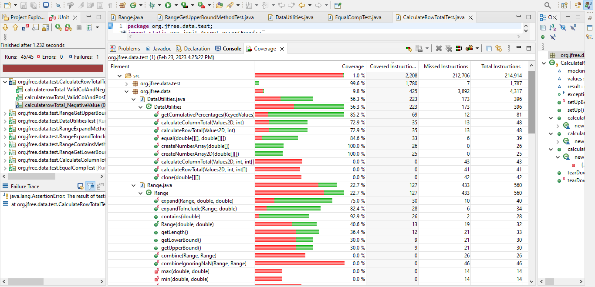
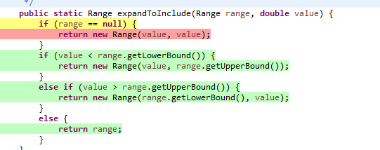
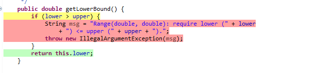
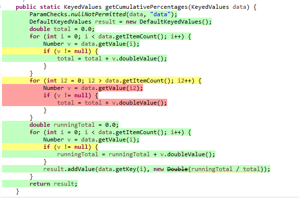
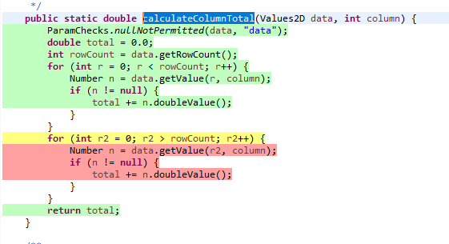

**SENG 637 - Dependability and Reliability of Software Systems**

**Lab. Report #3 – Code Coverage, Adequacy Criteria and Test Case Correlation**

| Group 8:      |     |
| -------------- | --- |
|Student Names |     |
|Amir Allahveran                 |  30216696   |
|Sepehr Ganji                |   30223725  |
|Zahra Arabi Narei         |  30191990   |
|Sara Montajab          |  30221523   |
|Amirhossein Foroughi          |  30228075   |


# 1 Introduction

Similar to the second assignment, this task utilized the test classes from the previous assignment, but we employed white-box coverage criteria to determine which test cases to create. Throughout this assignment, we encountered and gained the following insights:

1. To assess test adequacy, we initially learned to utilize code coverage tools (``EclEmma``).
We employed ``EclEmma`` as a test coverage tool in Eclipse.
2. Employing white-box techniques, we learned how to design test cases to enhance code coverage.
3. We became familiar with some of the advantages and limitations of measuring test adequacy with ``EclEmma``.
4. Our concluding step was to manually compute the data-flow coverage and comprehend its functioning.

# 2 Manual data-flow coverage calculations for X and Y methods

The two methods that are manually analyzed are : DataUtilities.calculateColumnTotal and Range.getUpperBound.

### **Def-use tables** :
#### calculateColumnTotal table:
DEF(123):= {data,column}, USE(123):= ∅ <br />
DEF(124):= ∅, USE(124):= {data} <br />
DEF(125):= {total}, USE(125):= ∅ <br />
DEF(126):= {rowCount}, USE(126):= {data} <br />
DEF(127):= {r}, USE(127):= {r,rowCount} <br />
DEF(128):= {n}, USE(128):= {data,r,column} <br />
DEF(129):= ∅, USE(129):= {n} <br /> 
DEF(130):= {total}, USE(130):= {total,n} <br /> 
DEF(131):= ∅, USE(131):= ∅<br />
DEF(132):= ∅, USE(132):= ∅<br />
DEF(133):= {r2}, USE(133):= {r2,rowCount}<br />
DEF(134):= {n}, USE(134):= {data,r2,column}<br />
DEF(135):= ∅, USE(135):= {n}<br />
DEF(135):= ∅, USE(135):= {n}<br />
DEF(136):= {total}, USE(136):= {total,n}<br />
DEF(137):= ∅, USE(137):= ∅<br />
DEF(138):= ∅, USE(138):= ∅<br />
DEF(139):= ∅, USE(139):= {total}<br />

#### getUpperBound table: <br />
DEF(118):= ∅, USE(118):= ∅<br />
DEF(119):= ∅, USE(119):= {upper,lower}<br />
DEF(120):= {msg}, USE(118):= {upper,lower}<br />
DEF(121):= ∅, USE(121):= ∅<br />
DEF(122):= ∅, USE(122):= {msg}<br />
DEF(123):= ∅, USE(123):= ∅<br />
DEF(124):= ∅, USE(124):= {upper}<br />

### The Data Flow Graphs :

#### DataUtilities.calculateColumnTotal : 


### List of the DU-Pairs Per Variable for each method: 

#### DataUtilities.calculateColumnTotal DU - Pairs : 

| Variable (v)  | Defined at node (n)  | dcu(v,n)  | dpu(v,n)                       |
|---------------|----------------------|-----------|--------------------------------|
| data          | 1                    | {4,6,11}  | {(2,End),(2,3)}                |
| column        | 1                    | {6,11}    | {}                             |
| total         | 3                    | {8,13,15} | {}                             |
| total         | 8                    | {8,13,15} | {}                             |
| total         | 13                   | {8,13,15} | {}                             |
| rowCount      | 4                    | {}        | {(5,6),(5,10),(10,11),(10,15)} |
| n             | 6                    | {8,13}    | {(7,8),(7,9)}                  |
| n             | 11                   | {8,13}    | {(12,13),(12,14)}              |
| Total         |                      | 18        | 10                             |

#### Range.getUpperBound DU - Pairs : 

| Variable (v)  | Defined at node (n)  | dcu(v,n) | dpu(v,n)      |
|---------------|----------------------|----------|---------------|
| upper         | ∅                    | {2,3}    | {(1,2),(1,3)} |
| lower         | ∅                    | {3}      | {(1,2),(1,3)} |
| Total         |                      | 3        | 4             |

When examining the coverages as indicated below in section 3, the getUpperBound method has a 50% branch coverage, which is also illustrated in the table above, showing that there are 0 DPU pairs compared to the expected 4. Upon reviewing the source code, the reason for the inability to cover those statements when the lower bound is greater than the upper bound is due to the fact that the constructor for the Range object prevents instances where the lower bound is greater than the upper bound by throwing an exception. Since the constructor does not permit this case to occur, it is impossible to increase coverage on the getUpperBound method. The primary solution is to remove the if statement in line 119, as it is redundant, given that this condition is already checked within the constructor.

| Variable (v)  | Defined at node (n)  | dcu(v,n)  | dpu(v,n)                       |
|---------------|----------------------|-----------|--------------------------------|
| data          | 1                    | {4,6}  | {(2,End),(2,3)}                |
| column        | 1                    | {6}    | {}                             |
| total         | 3                    | {8,15} | {}                             |
| total         | 13                   | {8,15} | {}                             |
| rowCount      | 4                    | {}        | {(5,6),(5,10)|
| n             | 6                    | {8,13}    | {(7,8),(7,9)}                  |
| Total         |                      | 9        | 6                          |

When analyzing these totals from the A2 test cases for the calculateColumnTotal method, they are nearly half the size of the DCU and DPU that we calculated by examining the original method. The primary reason for the lack of coverage in A2 is that none of the test cases ever entered the second for loop within the method, due to the fact that the variable r2 was never greater than the row count. Therefore, the obvious solution is to add a test case using null parameters to gain access to the second for loop within line 133.


# 3 A detailed description of the testing strategy for the new unit test

Initially, we executed EclEmma for the test cases that we wrote for Assignment 2. In the following screenshots, you can observe that we utilized Branch Coverage, Complexity Coverage, Instruction Coverage, Line Coverage, and Method Coverage for the DataUtilities and Range classes, and we have low testing coverage. For instance, you can notice that the method equal's Branch Coverage percentage is 75%, but after incorporating new test cases, all of them will improve.

Branch Coverage:


Complexity Coverage:


Instruction Coverage:


Line Counter Coverage:


Method Coverage:


# 4 A high level description of five selected test cases you have designed using coverage information, and how they have increased code coverage

## 4.a Range Class Methods
For the Range class, the methods that we selected for Assignment 2 include: ExpandToInclude, Expand, Contains, GetUpperBound, and GetLowerBound.

After using EclEmma to calculate the coverage for the test suite, we wrote new test cases to cover the uncovered branches.

### 4.a.1. ExpandToInclude Method:
 


Based on EclEmma output for this method, the null range is not covered on our test suit, so we add a new test case for covering null range.

```java
   public void testExpandToInclude_NullRange_ExpandsCorrectly() {
//    	null range should change to (value, value) range to include range
       Range expandedRange = Range.expandToInclude(null, 5);
       assertEquals(5, expandedRange.getLowerBound(), 0.0);
       assertEquals(5, expandedRange.getUpperBound(), 0.0);
    }
```
after adding above test case, the branch coverage for the method changes to 100 and all the lines in the method definition changes to green.


### 4.a.2. Expand Method:
For the expand method, the initial branch coverage was 50%, and the uncovered scenario was when, in expanding the range, the lower bound becomes larger than the upper bound. To cover this scenario, we added a test with negative margins.


```java
	@Test
	public void testExpand_changingTheupperboundAndLowerbound_ExpandsRangeCorrectly() {
		Range range = new Range(0, 10.0);
		Range expandedRange = Range.expand(range, -0.8, -0.8);
		assertEquals(5, expandedRange.getLowerBound(), 0.0);
		assertEquals(5, expandedRange.getUpperBound(), 0.0);

	}
```
after adding this test case the coverage changed to 100%.


### 4.a.3. Contains Method:


For the contains method, the last line of the code is highlighted in yellow, indicating that 2 of 4 branches are not covered in the test suite, resulting in a branch coverage of 75%. We attempted to add more test cases, but achieving higher branch coverage was not possible. This is because there is no scenario in which we can reach the last line of code with the conditions being false. Therefore, higher coverage is not achievable due to the unreachability of the code in this particular scenario.

### 4.a.4. GetLowerbound Method
The branch coverage for the GetLowerBound method was initially 50%. The uncovered branch is similar to the scenario in the GetUpperBound method, where a specific part of the code cannot be reached in our test suite. This limitation is due to the constraints imposed by the class's design, which prevents the lower bound from being greater than the upper bound. As a result, increasing the branch coverage for this method is not feasible within the current implementation.




## 4.b ِ  DataUtilities

For class DataUtilities methods, CreatNumberArray method had branch coverage of 100% based on previous test suits.

### 4.b.1 Equal Method
 
 The initial branch coverage for the equal method was 75%.
 


Based on EclEmma, the uncovered branches for this method was when the a is null, so we add a test suits where  a is null to cover both branch on b==null condition.

```java
    @Test
    public void testEqualMethod_withBothNullValue() {
    	double data1[][] = null;
    	double data2[][] = null;
    	assertTrue(DataUtilities.equal(data1, data2));
  			
    }
    
    @Test
    public void testEqualMethod_withOneNullValue() {
    	double data1[][] = null;
    	double data2[][] = {{1.0, 2.0, 3.0}, {4.0, 5.0, 6.0}};
    	assertFalse(DataUtilities.equal(data1, data2));
  			
    }
```

and we were able to change the branch coverage to 100%.


### 4.b.2 getCumulativePercentages Method
The initial branch coverage for the getCumulativePercentages method was 58.3%.



Using EclEmma we found the branch that we did not covred before and write new test case to cover it.
```java
	@Test
	public void getCumulativePercentageForNullValue() {
		//   verify 
			assertEquals(0.1, DataUtilities.getCumulativePercentages(KeyValues1).getValue(0).doubleValue(), .000000001d);
	}
```
and we were able to change the branch coverage to 75%.


### 4.b.3 calculateRowTotal Method
The initial branch coverage for the calculateRowTotal method was 50%.


Using EclEmma we found the branch that we did not covred before and write new test case to cover it.

```java
	@Test
	public void calculateRowTotalForRowOne_withNullValue() { 

		double result =DataUtilities.calculateRowTotal(values1, 0); 
		//   verify 
		assertEquals(result, 1.5, .000000001d);
		}
```
and we were able to change the branch coverage to 62.5%.


### 4.b.4 calculateColumnTotal Method
The initial branch coverage for the calculateColumnTotal method was 50%.


Using EclEmma we found the branch that we did not covred before and write new test case to cover it.

```java
	@Test
	public void calculateRowTotalForRowOne_withNullValue() { 

		double result =DataUtilities.calculateRowTotal(values1, 0); 
		//   verify 
		assertEquals(result, 1.5, .000000001d);
	}
```
and we were able to change the branch coverage to 62.5%.



# 5 A detailed report of the coverage achieved of each class and method (a screen shot from the code cover results in green and red color would suffice)

After running EclEmma for the test cases that we wrote for Assignment 2, plus the additional ones we added to increase coverage in this assignment, we observed significant improvements in our testing coverage. In the following screenshots, you can see that we utilized Branch Coverage, Complexity Coverage, Instruction Coverage, and Line Coverage for the DataUtilities and Range classes, and now we have high testing coverage. For example, the method equal's Branch Coverage percentage, which was 75% using the test cases from Assignment 2, is now 100%. This demonstrates the effectiveness of our added test cases in enhancing the overall coverage.


Branch Coverage:


Complexity Coverage:


Instruction coverage:


Line Counter Coverage:


# 6 Pros and Cons of coverage tools used and Metrics you report

The pros and cons of using EclEmma are as follows:

**Pros:**

1. **Integration with IDEs:** EclEmma integrates seamlessly with popular Java development environments, such as Eclipse and IntelliJ IDEA, making it convenient for developers to use within their existing workflows.
2. **Coverage Metrics:** EclEmma provides valuable metrics such as statement coverage and branch coverage, helping developers identify which parts of their code are being tested and which are not.
3. **Quality Improvement:** By highlighting untested parts of the code, EclEmma encourages developers to improve the quality and completeness of their test suite.
4. **Visual Reports:** The tool offers visual reports that aid developers in understanding the coverage of their code and pinpointing areas that require additional testing.
5. **Accessibility:** As an open-source tool, EclEmma is freely available to developers and teams of all sizes.

**Cons:**

1. **Limited Scope:** EclEmma focuses solely on code coverage, which is only one aspect of software quality. It does not ensure the correctness, completeness, or efficiency of the code.
2. **Resource Intensive:** For large codebases or complex applications, EclEmma can be resource-intensive and may slow down the testing process.
3. **Limited Suitability:** The tool may not be suitable for applications with heavy reliance on external systems or dependencies that are challenging to mock or test.
4. **Coverage vs. Quality:** EclEmma measures test coverage but does not assess the quality or completeness of the tests themselves.
5. **Potential for Misinterpretation:** In some cases, EclEmma might produce false positives or false negatives, especially for complex code paths or edge cases.

In summary, EclEmma can be a valuable tool for measuring the coverage of Java test suites, but it should be used alongside other quality assurance tools and practices to ensure comprehensive evaluation of the code's correctness, completeness, and efficiency.

# 7 A comparison on the advantages and disadvantages of requirements-based test generation and coverage-based test generation.

**1. Requirements-based test generation:**

**Advantages:**

- **Focused on Functional Requirements:** Ensures that test cases cover all functional requirements of the application, leading to a comprehensive evaluation of the software's intended behavior.
- **Identifies Requirement Gaps:** Can help uncover missing or incomplete requirements, contributing to a more robust and complete specification of the application.
- **Business Alignment:** Test cases are aligned with business goals and user needs, ensuring that the application meets the expectations of its stakeholders.
- **Compliance Assurance:** Useful for applications that need to meet specific regulatory or compliance requirements, as it ensures that all necessary conditions are tested.

**Disadvantages:**

- **Time and Cost:** Can be time-consuming and expensive, especially for complex or large-scale applications, due to the need for thorough analysis and documentation of requirements.
- **Limited to Functional Aspects:** May not adequately address non-functional requirements such as performance, security, or scalability.
- **Potential for Missed Scenarios:** May not cover all edge cases or unexpected scenarios that can arise during the use of the application.
- **Less Flexible:** May not be suitable for applications that are still evolving or subject to frequent changes, as the test generation process would need to be repeated with each change.

**2. Coverage-based test generation:**

**Advantages:**

- **Comprehensive Code Coverage:** Ensures that the test suite covers all code paths and branches, leading to a thorough evaluation of the application's implementation.
- **Detection of Subtle Defects:** Can help identify defects or errors in the application that might be difficult to detect through manual testing or other methods.
- **Alignment with Codebase:** Ensures that the test suite is comprehensive and directly related to the codebase of the application.
- **Automation and Integration:** Can be automated and integrated into the software development process, reducing the time and effort required for testing.

**Disadvantages:**

- **May Miss Functional Requirements:** Might not ensure that the test cases cover all functional requirements of the application, leading to potential gaps in the evaluation of the software's behavior.
- **Generation of Redundant Test Cases:** May produce redundant or irrelevant test cases that do not contribute to the quality of the test suite.
- **Limited Focus on Non-Functional Aspects:** May not adequately address non-functional requirements such as usability or user experience.
- **Potential for Missed Scenarios:** May not cover all edge cases or unexpected scenarios that can arise during the use of the application.

# 8 A discussion on how the team work/effort was divided and managed

All tests were conducted with all team members present simultaneously and collaboratively. However, when it came to writing the report, we divided the tasks among ourselves. We ensured that the workload, both in terms of quantity and type, was evenly distributed among all team members. This approach was feasible due to the more manageable and quantifiable nature of the assignment, which consisted of more discrete tasks. This division of labor provided equal learning opportunities for each team member while minimizing the workload. For collaboration purposes, we heavily relied on GitHub and in-person meetings.

# 9 Any difficulties encountered, challenges overcome, and lessons learned from performing the lab

During the lab, we encountered several difficulties and challenges, but we also learned valuable lessons from these experiences:

**Difficulties Encountered:**

1. **Understanding Complex Concepts:** Grasping complex concepts such as white-box coverage criteria and data-flow coverage was challenging initially.
2. **Setting Up Tools:** Setting up and configuring tools like EclEmma for code coverage analysis required some effort and troubleshooting.
3. **Designing Test Cases:** Designing effective test cases that covered all the required scenarios and branches was a time-consuming process.

**Challenges Overcome:**

1. **Collaboration:** Working collaboratively as a team helped us overcome individual knowledge gaps and provided a platform for peer learning.
2. **Incremental Testing:** By breaking down the testing process into smaller, manageable chunks, we were able to focus on one aspect at a time, making the overall process more efficient.
3. **Continuous Learning:** We overcame the challenge of understanding complex concepts by continuously learning and seeking clarification through various resources, including online forums, documentation, and discussions with peers and instructors.

**Lessons Learned:**

1. **Importance of Test Coverage:** We learned the significance of test coverage in ensuring the reliability and robustness of software.
2. **Effective Communication:** Effective communication within the team was crucial for dividing tasks, sharing knowledge, and ensuring that everyone was on the same page.
3. **Adaptability:** We learned to be adaptable and flexible in our approach, as we had to modify our test cases and strategies based on the coverage results and feedback.
4. **Attention to Detail:** The lab taught us the importance of paying attention to detail, especially when designing test cases and analyzing coverage results.
5. **Value of Collaboration:** Collaborating with team members, leveraging each other's strengths, and learning from each other's experiences were invaluable aspects of the lab experience.

# 10 Comments/feedback on the lab itself

Here's a shorter version of the comments and feedback on the lab:

**Positive Aspects:**
1. **Practical Application:** Hands-on experience with tools like EclEmma was valuable.
2. **Learning Opportunity:** The lab offered insights into white-box testing techniques.
3. **Teamwork:** Emphasized collaboration and teamwork.


**General Feedback:**

The lab was a valuable learning experience, though some improvements could enhance it further.
